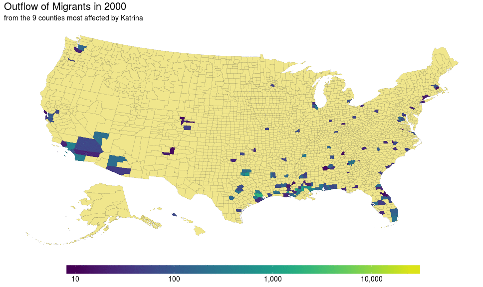

```{r, include=FALSE}
library(knitr)
opts_knit$set(root.dir = normalizePath(".."))
read_chunk("6-AERE.R")
knitr::opts_chunk$set(echo=FALSE, warning=FALSE, message=FALSE, out.width = "968px")
```

```{r start, include=FALSE}
# author: Robert Dinterman, Jonathan Eyer, Adam Rose, Noah Miller

```

# Overview

---- 

Talk will cover:

* Motivation and Research Question
* Data
* Empirical Strategy
* Results
* Economic Relevance

# Motivation and Research Question

## Growing Risks of Natural Disasters

* Climate change implies more frequent and more damaging disasters [@van2006impacts]
* Disasters do not discriminate with respect to wealth, but institutions and wealth helps mitigate deaths [@kahn2005death]
* Growing fiscal and social costs within the United States
    * More frequent FEMA disaster declarations
    * Higher federal costs for declared disasters
    * Non-disaster government transfers increases may understate true cost [@deryugina2016fiscal]

----

```{r}
ggplot(fema, aes(date, declarations)) +
  geom_line() +
  geom_point() +
  labs(title = "Annual FEMA Disaster Declarations", x = "", y = "") +
  theme_bw()
```


## Out of the Frying Pan?

* Some evidence that people move after big disasters
    * @boustan2017effect
    * @carleton2016social
* Rational actors respond to disasters by moving to new locations
    * Because their homes are destroyed?
    * Because the local economy is harmed?
    * Because they have updated their priors about risks?
* Move people out of dangerous areas, but does this lower future disaster costs?
* All else equal, higher exposure areas should see lower migration rates


## And Into the Fire?

* Disaster exposure is spatially correlated
* Disasters are negative income shocks and long moves are costly
* People tend to move relatively short distances
* If disasters induce shorter moves, migration may not lower future disaster costs
* **Shorter moves may not lower costs**
    * **Key question**: where do disaster migrants locate to?
    * And does migration mitigate impacts of disasters or simply rearrange the deck chairs?


# Hurricane Katrina

## Impacts

* Category 3 Hurricane at landing (sustained winds of 100–140 miles per hour)
* Landed 25 August 2005 in Louisiana
* Total damage estimated at \$108 billion [@knobb2005tropical]
* Deaths appear to be at least 1,500 [@beven2008atlantic]
* Triggered response of over \$5.7 billion in FEMA disaster relief

----

```{r la}
```

## How Did Katrina Affect New Orleans Migrants?

* Data from IRS county-to-county migration used, tracks filed tax returns at FIPS code from year to year
* Typical outmigration from New Orleans area from 2000 to 2010 excluding 2005 averaged `r prettyNum(round(sum(hurricane$exmpt_katrina[hurricane$year > 1999 & hurricane$year < 2011 & hurricane$year != 2005], na.rm = T)/10), big.mark = ",", scientific = FALSE)` outmigrants per year (average population of `r prettyNum(round(sum(hurricane$tot_pop[hurricane$year > 1999 & hurricane$year < 2011 & hurricane$year != 2005 & (hurricane$fips %in%katrina)], na.rm = T)/10), big.mark = ",", scientific = FALSE)`)
    * Parishes - Jefferson, Lafourche, Orleans, Plaquemines, St. Bernard, St. Charles, St. John the Baptist, and St. Tammany, and Terrebonne
    * Fairly stable spatial distribution - nearby and large metro regions
* In 2005, total of `r prettyNum(round(sum(hurricane$exmpt_katrina[hurricane$year == 2005], na.rm = T)), big.mark = ",", scientific = FALSE)` outmigrants
    * Similar spatial pattern exists plus evident overflow

----



----

```{r static-1}
```

----

```{r static-2}
```


# Empirical Strategy


## Gravity Model

Beginings from Newtonian physics, which imply

$$ F = G \frac{m_1 m_2}{r^2} $$

Princeton Astronomer James Q. Stewart observed the composition of students in his classroom [@stewart1941inverse]:

$$ M_{ij} = k \frac{P_{i}^{\beta_1} P_{j}^{\beta_2}}{D_{ij}^{\gamma}} $$


## Modified

For outmigration from Katrina affected areas:

$$ m_{i,t} = \alpha + \gamma D_{i} + \beta_1 P_{i,t} + \beta_2 {Katrina} + \beta_3 \mathbf{X_{i,t}} + \varepsilon_{i,t}$$ 

* $i$ indicates county destination and $t$ indicates year
* $m$ is migration measure
    * Raw flow, inverse hyperbolic sine, share of outflow, and indicator of positive migration
* $D$ indicates distance from centroid of affected area
* $P$ is the population for destination county
* ${Katrina}$ is dummy variable for 2005
* $\mathbf{X_{i,t}}$ are economic characteristics: unemployment rate, median rent, average pay


## Modified

Model entails destination's distance from New Orleans, its population, a Katrina indicator for 2005, and economic indicators.

* Panel of migration outflow from affected counties from 2000 to 2010
* Start with baseline model of New Orleans area destinations 
* Interact explanatory variables with Katrina variable
* Attribute change in effects to the disaster response

# Results

----

|                   |Flow       |IHS        |LP         |Share     |
|:------------------|:----------|:----------|:----------|:---------|
|Distance           |-1.8062*** |-0.0239*** |-0.0048*** |-0.005*** |
|(hundreds of km)   |(0.4165)   |(0.0027)   |(5e-04)    |(0.0012)  |
|Population         |193.1327*  |1.9915***  |0.3992***  |0.474**   |
|(millions)         |(110.3825) |(0.463)    |(0.1027)   |(0.2188)  |
|Katrina            |51.6205*** |0.4618***  |0.092***   |-1e-04    |
|                   |(12.9152)  |(0.0222)   |(0.005)    |(0.0038)  |
|Adjusted R-Squared |0.037      |0.305      |0.288      |0.114     |

Table: Baseline

----

|                    |Flow      |IHS        |LP         |Share     |
|:-------------------|:---------|:----------|:----------|:---------|
|Unemployment Rate   |-12.6374  |-1.4173*** |-0.3361*** |-0.1494** |
|                    |(29.0974) |(0.3073)   |(0.0689)   |(0.0688)  |
|Average Annual Pay  |0.7527*   |0.0155***  |0.0036***  |0.002*    |
|(in thousands)      |(0.4318)  |(0.0042)   |(9e-04)    |(0.001)   |
|Median Monthly Rent |-3.9009   |0.0166     |0.0057*    |-0.0071   |
|(in hundreds)       |(3.7921)  |(0.0138)   |(0.0031)   |(0.0076)  |
|Adjusted R-Squared  |0.037     |0.305      |0.288      |0.114     |

Table: Baseline Economic Characteristics

## {.smaller}

|                   |Flow       |IHS        |LP         |Share     |
|:------------------|:----------|:----------|:----------|:---------|
|Distance           |-1.1153*** |-0.0197*** |-0.004***  |-0.005*** |
|(hundreds of km)   |(0.2699)   |(0.0026)   |(5e-04)    |(0.0012)  |
|Interaction        |-7.2918*** |-0.0528*** |-0.0099*** |2e-04     |
|                   |(1.6765)   |(0.0035)   |(8e-04)    |(6e-04)   |
|Population         |101.5004** |1.9065***  |0.3929***  |0.4588**  |
|(millions)         |(45.2713)  |(0.4314)   |(0.0989)   |(0.1978)  |
|Interaction        |1054.9499  |0.7248**   |0.0198     |0.1771    |
|                   |(772.432)  |(0.3459)   |(0.0428)   |(0.2535)  |
|Katrina            |95.5467    |-1.5462*** |-0.3372*** |-0.0042   |
|                   |(216.3368) |(0.2037)   |(0.0366)   |(0.0861)  |
|Adjusted R-Squared |0.112      |0.336      |0.309      |0.115     |

Table: Katrina Interactions

## {.smaller}

|                    |Flow         |IHS        |LP         |Share      |
|:-------------------|:------------|:----------|:----------|:----------|
|Unemployment Rate   |-55.4713***  |-1.4865*** |-0.3467*** |-0.1844*** |
|                    |(15.697)     |(0.2911)   |(0.0678)   |(0.0704)   |
|Interaction         |1030.2041*** |9.2898***  |1.8593***  |0.7037***  |
|                    |(385.1283)   |(1.4963)   |(0.3017)   |(0.2396)   |
|Average Annual Pay  |0.4678**     |0.0138***  |0.0033***  |0.002**    |
|(in thousands)      |(0.2186)     |(0.004)    |(9e-04)    |(0.001)    |
|Interaction         |2.8474       |0.028***   |0.0053***  |0          |
|                    |(3.5034)     |(0.0058)   |(0.0012)   |(0.0013)   |
|Median Monthly Rent |-1.4195      |0.0023     |0.0024     |-0.0063    |
|(in hundreds)       |(1.3117)     |(0.0132)   |(0.0031)   |(0.0068)   |
|Interaction         |-29.4207     |0.246***   |0.056***   |-0.0091    |
|                    |(36.7561)    |(0.0275)   |(0.0059)   |(0.0132)   |
|Adjusted R-Squared  |0.112        |0.336      |0.309      |0.115      |

Table: Katrina Economic Interactions

# Conclusion


## A role for policy

* Katrina's impact on outmigration increased the outflows in both volume and breadth, but the distribution of appears unaffected
* Katrina disaster migrants do not migrate as far from New Orleans than in non-disaster years and destination population became less important
* Economic variables indicate mixed results with respect to migration decision of Katrina migrants
* Migration decisions do not appear to mitigate risk as measured via distance
* Data limitations constrain the ability to determine the degree to which migrants return to New Orleans

## Thank You

Questions or comments?

* email: dinterman.1@osu.edu

## References

<style>
slides > slide { overflow: scroll; }
slides > slide:not(.nobackground):after {
  content: '';
}
</style>